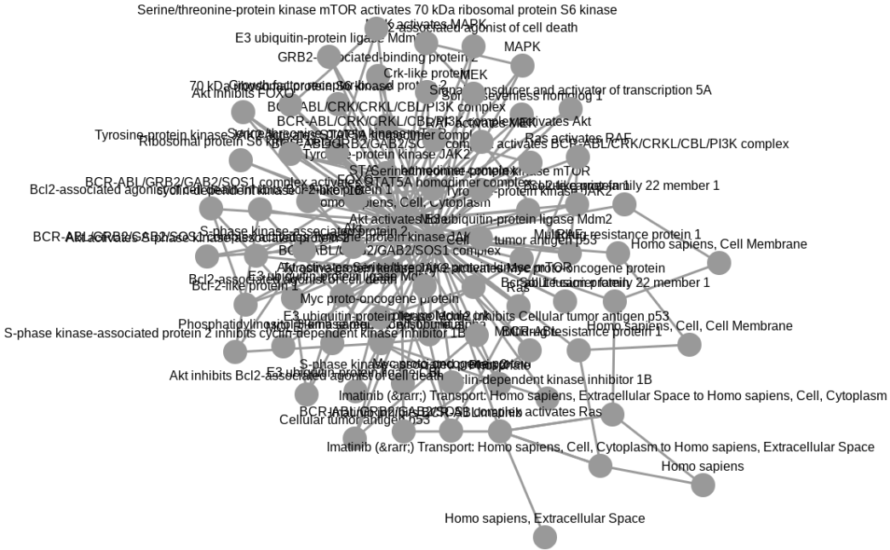

Introduction
============

Networks are a powerful and flexible methodology for expressing
biological knowledge for computation and communication. Biological
networks can hold a variety of different types of information, like
genetic or metabolic interactions, gene, and transcriptional regulation,
protein-protein interaction (PPI), or cell signaling networks and
pathways. They often form a valuable resource for hypothesis generation
and further investigations, and in the course of the analyses, they are
processed and enriched with additional information from experiments. As
a result further networks are generated, whether as intermediate results
that should be documented in the process, as the outcome of those
analyses, or as visual representations and illustrations used in reports
and publications. As a consequence, these resulting networks do not
follow anymore the strict rules the source networks were subjected,
therefore a more flexible format is needed to capture their content.

In addition, suitable solutions for transmission conflict with those for
storage, or usage in applications and analyses. Therefore, seamless
conversion between those different formats becomes as important as the
data itself.

The Cytoscape Exchange (CX)
---------------------------

A possible solution as flexible transmission format is provided by the
Cytoscape Exchange (CX) format. CX is a JSON-based, aspect-oriented data
structure, which means that the network is divided into several
independent modules (“aspects”). This way, every aspect of a network,
meaning nodes, edges, its attributes, and visual representations can be
handled individually without interference. Each aspect has its own
schema for its contained information, and links between aspects are
realized by referencing the unique internal IDs of other aspects. The CX
data model was developed by the NDEx project, in collaboration with the
Cytoscape Consortium
(<a href="http://www.cytoscapeconsortium.org/" class="uri">http://www.cytoscapeconsortium.org/</a>)
as a transmission format between their tools, and since adopted by many
others. More details about the CX data model can be found on its
documentation website:
<a href="https://home.ndexbio.org/data-model/" class="uri">https://home.ndexbio.org/data-model/</a>

The NDEx platform
-----------------

The Network Data Exchange, or NDEx, is an online commons for biological
networks (Pratt et al., 2015, Cell Systems 1, 302-305, October 28, 2015
©2015 Elsevier
Inc. [ScienceDirect](http://www.sciencedirect.com/science/article/pii/S2405471215001477)).
It is an open-source software framework to manipulate, store, and
exchange networks of various types and formats. NDEx can be used to
upload, share and publicly distribute networks while providing an output
in formats, that can be used by plenty of other applications.

The public NDEx server is a network data commons that provides pathway
collections like the Pathway Interaction Database of the NCI
(<a href="http://www.ndexbio.org/#/user/301a91c6-a37b-11e4-bda0-000c29202374" class="uri">http://www.ndexbio.org/#/user/301a91c6-a37b-11e4-bda0-000c29202374</a>)
and the Cancer Cell Maps Initiative
(<a href="http://www.ndexbio.org/#/user/b47268a6-8112-11e6-b0a6-06603eb7f303" class="uri">http://www.ndexbio.org/#/user/b47268a6-8112-11e6-b0a6-06603eb7f303</a>).
Public networks can be searched and retrieved from the platform for
further use. Own networks can be uploaded and shared with certain
collaborators or groups privately or provided publicly to the community.
Furthermore, private installation of the NDEx platform can be used to
store and collaborate on networks locally.

The ndexr package available on Bioconductor
(<a href="https://doi.org/doi:10.18129/B9.bioc.ndexr" class="uri">https://doi.org/doi:10.18129/B9.bioc.ndexr</a>)
allows connecting with the NDEx platform from within R. This package
provides an interface to query the public NDEx server, as well as
private installations, to upload, download or modify biological
networks.

Cytoscape
---------

The most prominent software environment for biological network analysis
and visualization is Cytoscape
(<a href="https://cytoscape.org/" class="uri">https://cytoscape.org/</a>).
It provides support for large networks and comes with a rich set of
features for custom visualization, and advanced layout and analysis
algorithms. One of these visualization features is the
“attribute-to-visual mapping”, where the network’s data translates to
its visual representation. Based on this visualization strategy,
Cytoscape contributed aspects to the CX-format to capture the visual
representation as part of the network. Because of these aspects, the
visualization not only can be documented along with the network, but
also reproduced on other platforms, and even shared between networks
with the same attributes used for creating the visualization.

RCX - an adaption of the CX format
----------------------------------

CX is a JSON-based data structure designed as a flexible model for
transmitting networks with a focus on flexibility, modularity, and
extensibility. Although those features are widely used in common REST
protocols they don’t quite fit the R way of thinking about data.

This package provides an adaption of the CX format to standard R data
formats and types to create and modify, load, export, and visualize
those networks. This document aims to help the user to install and
benefit from the wide range of functionality of this implementation. For
an overview of the differences of the RCX implementation to the CX
specification see [Appendix: The RCX and CX Data
Model](vignettes/Appendix_The_RCX_and_CX_Data_Model.Rmd)

Installation
============

``` r
if (!"RCX" %in% installed.packages()) {
    require(devtools)
    install_github("frankkramer-lab/RCX")
}
library(RCX)
```

The basics
==========

In the following, it will be explained, how to read and write networks
from/to CX files, create and modify RCX networks, validate its contents
and finally visualize them.

Read and write CX files
-----------------------

Networks can be downloaded from the [NDEx
plattform](http://ndexbio.org/) as CX files in JSON format. Those files
can be read, and are automatically transformed into RCX networks that
can be used in R. Here we load a provided example network from file:

``` r
cxFile <- system.file(
  "extdata", 
  "Imatinib-Inhibition-of-BCR-ABL-66a902f5-2022-11e9-bb6a-0ac135e8bacf.cx", 
  package = "RCX"
)

rcx = readCX(cxFile)
```

This network also can be accessed and downloaded from NDEx at
<a href="https://www.ndexbio.org/viewer/networks/66a902f5-2022-11e9-bb6a-0ac135e8bacf" class="uri">https://www.ndexbio.org/viewer/networks/66a902f5-2022-11e9-bb6a-0ac135e8bacf</a>

RCX networks can be saved in a similar manner:

``` r
writeCX(rcx, "path/to/some-file.cx")
```

However, there might some errors occur while reading CX file. This might
happen, because the definition of the CX has changed over time, and so
the definition of some aspects. Therefore it is possible, that there are
still some networks stored at the NDEx platform following a deprecated
format. In those cases it might be helpful to process the CX network
step by step:

**1.** just read the JSON content without parsing

``` r
json <- readJSON(cxFile)

substr(json, 1, 77)
```

    ## [{"numberVerification":[{"longNumber":281474976710655}]},{"metaData":[{"name"

This also allows to handle a CX network in JSON format, even if it comes
from a different source instead of a file.

**2.** parse the JSON

``` r
aspectList <- parseJSON(json)

str(aspectList, 2)
```

    ## List of 12
    ##  $ :List of 1
    ##   ..$ numberVerification:List of 1
    ##  $ :List of 1
    ##   ..$ metaData:List of 9
    ##  $ :List of 1
    ##   ..$ provenanceHistory:List of 1
    ##  $ :List of 1
    ##   ..$ nodes:List of 75
    ##  $ :List of 1
    ##   ..$ edges:List of 159
    ##  $ :List of 1
    ##   ..$ networkAttributes:List of 10
    ##  $ :List of 1
    ##   ..$ nodeAttributes:List of 1129
    ##  $ :List of 1
    ##   ..$ edgeAttributes:List of 229
    ##  $ :List of 1
    ##   ..$ cartesianLayout:List of 75
    ##  $ :List of 1
    ##   ..$ cyVisualProperties:List of 3
    ##  $ :List of 1
    ##   ..$ cyHiddenAttributes:List of 1
    ##  $ :List of 1
    ##   ..$ status:List of 1

The result of the parsing are nested lists containing all aspects and
its contents. This format not easy to handle in R, but allows error
correction previous to forming aspect and RCX objects.

**3.** process the aspect data

``` r
rcx <- processCX(aspectList)
```

All the above function for processing CX networks come with an option to
show the performed steps. This might be helpful for finding occurring
errors:

``` r
rcx <- readCX(cxFile, verbose = TRUE)
```

    ## Read file "R/x86_64-pc-linux-gnu-library/4.0/RCX/extdata/Imatinib-Inhibition-of-BCR-ABL-66a902f5-2022-11e9-bb6a-0ac135e8bacf.cx"...done!
    ## Parse json...done!
    ## Parsing nodes...create aspect...done!
    ## Create RCX from parsed nodes...done!
    ## Parsing edges...create aspect...done!
    ## Add aspect "edges" to RCX...done!
    ## Parsing node attributes...create aspect...done!
    ## Add aspect "nodeAttributes" to RCX...done!
    ## Parsing edge attributes...create aspect...done!
    ## Add aspect "edgeAttributes" to RCX...done!
    ## Parsing network attributes...create aspect...done!
    ## Add aspect "networkAttributes" to RCX...done!
    ## Parsing cartesian layout...create aspect...done!
    ## Add aspect "cartesianLayout" to RCX...done!
    ## Parsing Cytoscape visual properties...done!
    ## - Create sub-objects...done!
    ## - Create aspect...done!
    ## Add aspect "cyVisualProperties" to RCX...done!
    ## Parsing Cytoscape hidden attributes...create aspect...done!
    ## Add aspect "cyHiddenAttributes" to RCX...done!
    ## Parsing meta-data...done!
    ## Ignore "numberVerification" aspect, not necessary in RCX!
    ## Can't process aspect "numberVerification", so skip it...done!
    ## Don't know what to do with a "provenanceHistory" aspect!
    ## Can't process aspect "provenanceHistory", so skip it...done!
    ## Ignore "status" aspect, not necessary in RCX!
    ## Can't process aspect "status", so skip it...done!

This shows, that some aspects that are contained in the CX file are
ignored while creating the RCX network. Those are for example aspects
needed for transmission of the CX (`status`, `numberVerification`), or
deprecated aspects (`provenanceHistory`). For more details about the
differences in aspects see [Appendix: The RCX and CX Data
Model](Appendix_The_RCX_and_CX_Data_Model.Rmd).

Explore the RCX object
----------------------

The simplest way to have a look at the content of an RCX object is by
printing it:

``` r
print(rcx)
## OR:
rcx
```

However, especially for large networks this can produce long and hardly
readable output. To get a better overview of the contained aspects, the
mandatory and automatically generated `metaData` aspect provides
information about the contained aspects. This includes information about
the number of elements or the highest used ID, if an aspect uses
internal IDs:

``` r
rcx$metaData
```

    ## Meta-data:
    ##                 name version idCounter elementCount consistencyGroup
    ## 1              nodes     1.0     11551           75                1
    ## 2              edges     1.0     11554          159                1
    ## 3     nodeAttributes     1.0        NA         1129                1
    ## 4     edgeAttributes     1.0        NA          229                1
    ## 5  networkAttributes     1.0        NA           10                1
    ## 6    cartesianLayout     1.0        NA           75                1
    ## 7 cyVisualProperties     1.0        NA            3                1
    ## 8 cyHiddenAttributes     1.0        NA            1                1

Besides exploring the RCX-object manually, a summary of the object, or
single aspects, can provide more insight on them:

``` r
summary(rcx$nodeAttributes)
```

    ##       propertyOf        name               value    
    ##  Total     : 1129   Length:1129        Boolean:185  
    ##  Unique ids:   75   Unique:34          Double : 92  
    ##  Min.      :11321   Class :character   Integer: 68  
    ##  Max.      :11551                      String :784

We already can quickly see that there are many different node attributes
are used. The different node attributes are:

``` r
unique(rcx$nodeAttributes$name)
```

    ##  [1] "sbo"                   "metaId"                "compartmentCode"      
    ##  [4] "sbml type"             "sbml id"               "reversible"           
    ##  [7] "sbml compartment"      "cyId"                  "label"                
    ## [10] "sbml type ext"         "fast"                  "constant"             
    ## [13] "units"                 "boundaryCondition"     "derivedUnits"         
    ## [16] "sbml initial amount"   "value"                 "substanceUnits"       
    ## [19] "hasOnlySubstanceUnits" "uniprot"               "inchikey"             
    ## [22] "chebi"                 "biocyc"                "cas"                  
    ## [25] "chemspider"            "kegg.compound"         "inchi"                
    ## [28] "pubchem.compound"      "hmdb"                  "scale"                
    ## [31] "exponent"              "kind"                  "multiplier"           
    ## [34] "unitSid"

Visualize the network
---------------------

This package provides simple functions to visualize the network encoded
in the RCX object.

``` r
visualize(rcx)
```


The visualization also utilizes the same JavaScript library as the NDEx
platform. Therefore the visual result is the same as when the network is
uploaded to the NDEx platform. Additionally, this allows the
visualization to be exported as a single HTML file, which can directly
be hosted on a web-server or included in existing websites:

``` r
writeHTML(rcx, "path/to/some-file.html")
```

Networks with many nodes and edges, or those without a provided layout,
often are difficult to interpret visually. To untangle the “hairball” it
is possible to apply different layout option provided by the
[Cytoscape.js](https://js.cytoscape.org/) framework. A force driven
layout is a good starting point in those cases. For demonstration
purposes, let’s delete the visual layout of our network first:

``` r
## save them for later
originalVisualProperties <- rcx$cyVisualProperties

## and delete them from the RCX network
rcx$cyVisualProperties <- NULL
rcx <- updateMetaData(rcx)

rcx$metaData
```

    ## Meta-data:
    ##                 name version idCounter elementCount consistencyGroup
    ## 1              nodes     1.0     11551           75                1
    ## 2              edges     1.0     11554          159                1
    ## 3     nodeAttributes     1.0        NA         1129                1
    ## 4     edgeAttributes     1.0        NA          229                1
    ## 5  networkAttributes     1.0        NA           10                1
    ## 6    cartesianLayout     1.0        NA           75                1
    ## 7 cyHiddenAttributes     1.0        NA            1                1

Lets have a look at the visualization now:

``` r
visualize(rcx, layout = c(name = "cose"))
```


Unfortunately no labels are shown in the network. We can fix that by
defining a simple pass-through mapping for the node labels and add it to
the network:

``` r
cyMapping <- createCyVisualPropertyMappings(
  name= "NODE_LABEL" ,
  type = "PASSTHROUGH",
  definition = "COL=label,T=string"
)

cyVisualProperties <- createCyVisualProperties(
  defaultNodes = createCyVisualProperty(
    mappings = cyMapping
  )
)

rcx <- updateCyVisualProperties(rcx, cyVisualProperties)
```

By default the visualization is opened in RStudio, but it also can be
forced to open in an external browser. The `Cytoscape.js` parameters
used to customize the layout algorithm can be found in it documentation
at
<a href="https://js.cytoscape.org/#layouts/cose" class="uri">https://js.cytoscape.org/#layouts/cose</a>

``` r
visualize(
  rcx, 
  layout = c(
    name="cose", 
    idealEdgeLength="80", 
    edgeElasticity="250"), 
  openExternal = TRUE)
```



Validation
----------

The correctness of the RCX network is important for the conversion to
CX, and therefore to be used at all platforms and tools. The validity of
the an RCX network can be checked simply:

``` r
validate(rcx)
```

    ## Checking Nodes Aspect:
    ## - Is object of class "NodesAspect"...OK
    ## - All required columns present (id)...OK
    ## - Column (id) doesn't contain any NA values...OK
    ## - At least one node present...OK
    ## - Column (id) contains only unique values...OK
    ## - Column (id) only contains numeric values...OK
    ## - Column (id) only contains positive (>=0) values...OK
    ## - No merge artefacts present (i.e. column with old ids: oldId)...OK
    ## - Only allowed columns present (id, name, represents)...OK
    ## >> Nodes Aspect: OK
    ## 
    ## Checking Edges Aspect:
    ## - Is object of class "EdgesAspect"...OK
    ## - All required columns present (id, source, target)...OK
    ## - Column (id) doesn't contain any NA values...OK
    ## - Column (id) contains only unique values...OK
    ## - Column (id) only contains numeric values...OK
    ## - Column (id) only contains positive (>=0) values...OK
    ## - Column (source) doesn't contain any NA values...OK
    ## - Column (source) only contains numeric values...OK
    ## - Column (source) only contains positive (>=0) values...OK
    ## - Column (target) doesn't contain any NA values...OK
    ## - Column (target) only contains numeric values...OK
    ## - Column (target) only contains positive (>=0) values...OK
    ## - No merge artefacts present (i.e. column with old ids: oldId)...OK
    ## - Only allowed columns present (id, source, target, name, interaction)...OK
    ## >> Edges Aspect: OK
    ## 
    ## Checking Node Attributes Aspect:
    ## - Is object of class "NodeAttributesAspect"...OK
    ## - All required columns present (propertyOf, name, value, dataType, isList)...OK
    ## - Combination of columns (propertyOf, name) contains only unique values...OK
    ## - Column (propertyOf) doesn't contain any NA values...OK
    ## - Column (propertyOf) only contains numeric values...OK
    ## - Column (propertyOf) only contains positive (>=0) values...OK
    ## - Is the column (name) a character vector...OK
    ## - Is the column (value) a list...OK
    ## - Column (dataType) doesn't contain any NA values...OK
    ## - Is the column (dataType) a character vector...OK
    ## - All values of dataType are in the allowed set (boolean, integer, long, double, string)...OK
    ## - Column (isList) doesn't contain any NA values...OK
    ## - Column (isList) only contains logical values...OK
    ## - Only allowed columns present (propertyOf, name, value, dataType, isList)...OK
    ## >> Node Attributes Aspect: OK
    ## 
    ## Checking Edge Attributes Aspect:
    ## - Is object of class "EdgeAttributesAspect"...OK
    ## - All required columns present (propertyOf, name, value, dataType, isList)...OK
    ## - Combination of columns (propertyOf, name) contains only unique values...OK
    ## - Column (propertyOf) doesn't contain any NA values...OK
    ## - Column (propertyOf) only contains numeric values...OK
    ## - Column (propertyOf) only contains positive (>=0) values...OK
    ## - Is the column (name) a character vector...OK
    ## - Is the column (value) a list...OK
    ## - Column (dataType) doesn't contain any NA values...OK
    ## - Is the column (dataType) a character vector...OK
    ## - All values of dataType are in the allowed set (boolean, integer, long, double, string)...OK
    ## - Column (isList) doesn't contain any NA values...OK
    ## - Column (isList) only contains logical values...OK
    ## - Only allowed columns present (propertyOf, name, value, dataType, isList)...OK
    ## >> Edge Attributes Aspect: OK
    ## 
    ## Checking Network Attributes Aspect:
    ## - Is object of class "NetworkAttributesAspect"...OK
    ## - All required columns present (name, value, dataType, isList)...OK
    ## - Column (name) contains only unique values...OK
    ## - Is the column (name) a character vector...OK
    ## - Is the column (value) a list...OK
    ## - Column (dataType) doesn't contain any NA values...OK
    ## - Is the column (dataType) a character vector...OK
    ## - All values of dataType are in the allowed set (boolean, integer, long, double, string)...OK
    ## - Column (isList) doesn't contain any NA values...OK
    ## - Column (isList) only contains logical values...OK
    ## - Only allowed columns present (name, value, dataType, isList)...OK
    ## >> Network Attributes Aspect: OK
    ## 
    ## Checking Cartesian Layout Aspect:
    ## - Is object of class "CartesianLayoutAspect"...OK
    ## - All required columns present (node, x, y)...OK
    ## - Column (node) contains only unique values...OK
    ## - Column (node) only contains numeric values...OK
    ## - Column (node) doesn't contain any NA values...OK
    ## - Column (x) only contains numeric values...OK
    ## - Column (x) doesn't contain any NA values...OK
    ## - Column (y) only contains numeric values...OK
    ## - Column (y) doesn't contain any NA values...OK
    ## - Only allowed columns present (node, x, y, z)...OK
    ## >> Cartesian Layout Aspect: OK
    ## 
    ## Checking Cytoscape Visual Properties Aspect:
    ## - Is object of class "CyVisualPropertiesAspect"...OK
    ## - Is object a list...OK
    ## - Is a named list ("network", "nodes", "edges", "defaultNodes" or "defaultEdges")...OK
    ## - The list only contains entries of class "CyVisualProperty"...OK
    ## - At least one of the elements present (network, nodes, edges, defaultNodes, defaultEdges)...OK
    ## For defaultNodes: Checking Cytoscape Visual Property sub-aspect:
    ## - Is object of class "CyVisualProperty"...OK
    ## - Is object a list...OK
    ## - Is a named list ("appliesTo", "view", "properties", "dependencies" or "mappings")...OK
    ## - List element (appliesTo) only contains numeric values...OK
    ## - List element (view) only contains numeric values...OK
    ## - Combination of columns (appliesTo, view) contains only unique values...OK
    ## - At least one of the elements present (properties, dependencies, mappings)...OK
    ##   Checking Cytoscape Visual Property Mappings:
    ## - Is mappings a list...OK
    ## - The list only contains entries of class "CyVisualPropertyMappings"...OK
    ## - All required columns present (name, type, definition)...OK
    ## - All list elements of name contain only character values...OK
    ## - All list elements of name don't contain any NA values...OK
    ## - All list elements (name) contain only unique values...OK
    ## - All list elements of type contain only character values...OK
    ## - All list elements of type don't contain any NA values...OK
    ## - All list elements of definition contain only character values...OK
    ## - All list elements of definition don't contain any NA values...OK
    ## - Only allowed columns present (name, type, definition)...OK
    ## >> Cytoscape Visual Property sub-aspect: OK
    ## >> Cytoscape Visual Properties Aspect: OK
    ## 
    ## Checking Cytoscape Hidden Attributes Aspect:
    ## - Is object of class "CyHiddenAttributesAspect"...OK
    ## - All required columns present (name, value, dataType, isList)...OK
    ## - Column (name) contains only unique values...OK
    ## - Is the column (name) a character vector...OK
    ## - Is the column (value) a list...OK
    ## - Column (dataType) doesn't contain any NA values...OK
    ## - Is the column (dataType) a character vector...OK
    ## - All values of dataType are in the allowed set (boolean, integer, long, double, string)...OK
    ## - Column (isList) doesn't contain any NA values...OK
    ## - Column (isList) only contains logical values...OK
    ## - Only allowed columns present (name, value, dataType, isList)...OK
    ## >> Cytoscape Hidden Attributes Aspect: OK
    ## 
    ## Checking RCX:
    ## - Is object of class "RCX"...OK
    ## - nodes aspect is present...OK
    ## - Validate nodes aspect...OK
    ## - Validate edges aspect...OK
    ##   - Reference aspect (nodes) present and correct...OK
    ##   - All id references exist (EdgesAspect$source ids in NodesAspect$id)...OK
    ##   - All id references exist (EdgesAspect$target ids in NodesAspect$id)...OK
    ## - Validate node attributes aspect...OK
    ##   - Reference aspect (nodes) present and correct...OK
    ##   - All id references exist (NodeAttributesAspect$propertyOf ids in NodesAspect$id)...OK
    ## - Validate edge attributes aspect...OK
    ##   - Reference aspect (edges) present and correct...OK
    ##   - All id references exist (EdgeAttributesAspect$propertyOf ids in EdgesAspect$id)...OK
    ## - Validate network attributes aspect...OK
    ## - Validate cartesian layout aspect...OK
    ##   - Reference aspect (nodes) present and correct...OK
    ##   - All id references exist (CartesianLayoutAspect$node ids in NodesAspect$id)...OK
    ## - Validate cytoscape visual property aspect...OK
    ## - Validate cytoscape hidden attributes aspect...OK
    ## >> RCX: OK

The verbose output also shows at which tests are performed. Let’s
manually introduce an error in an aspect and validate only this one
again. Therefore we simply duplicate a node ID.

``` r
nodes <- rcx$nodes
nodes$id[1] <- nodes$id[2]

test <- validate(nodes)
```

    ## Checking Nodes Aspect:
    ## - Is object of class "NodesAspect"...OK
    ## - All required columns present (id)...OK
    ## - Column (id) doesn't contain any NA values...OK
    ## - At least one node present...OK
    ## - Column (id) contains only unique values...FAIL
    ## - Column (id) only contains numeric values...OK
    ## - Column (id) only contains positive (>=0) values...OK
    ## - No merge artefacts present (i.e. column with old ids: oldId)...OK
    ## - Only allowed columns present (id, name, represents)...OK
    ## >> Nodes Aspect: FAIL

``` r
test
```

    ## [1] FALSE

As expected, the test fails and returns `FALSE`.

Get information about the networks
==================================

It is always useful to get some basic information about the network. For
example this can be the number of elements in the different aspects of
the network:

``` r
countElements(rcx)
```

    ##              NodesAspect           MetaDataAspect              EdgesAspect 
    ##                       75                       NA                      159 
    ##     NodeAttributesAspect     EdgeAttributesAspect  NetworkAttributesAspect 
    ##                     1129                      229                       10 
    ##    CartesianLayoutAspect CyHiddenAttributesAspect CyVisualPropertiesAspect 
    ##                       75                        1                        1

This also works for single aspects:

``` r
countElements(rcx$nodes)
```

    ## [1] 75

To determine, if an aspect contains IDs (on the contrary to knowing it
beforehand), this can be checked with:

``` r
hasIds(rcx$nodes)
```

    ## [1] TRUE

If an aspect has IDs, one can check what the highest used ID is, to know
at which ID the next elements have to continue before adding them. This
can even be done for the whole network at once.

``` r
maxId(rcx$nodes)
```

    ## [1] 11551

``` r
maxId(rcx)
```

    ## NodesAspect EdgesAspect 
    ##       11551       11554

Since we now know, that the nodes aspect has IDs, we can also determine
the name of the property that holds the IDs:

``` r
idProperty(rcx$nodes)
```

    ## [1] "id"

Other aspects use those IDs to reference to them. Let’s find out, which
aspect is referred by others:

``` r
referredBy(rcx)
```

    ## $NodesAspect
    ## [1] "EdgesAspect"           "NodeAttributesAspect"  "CartesianLayoutAspect"
    ## 
    ## $EdgesAspect
    ## [1] "EdgeAttributesAspect"

The nodes aspect is referred by the edges aspect, so we can find out
which properties of the edges aspect refer to it:

``` r
refersTo(rcx$edges)
```

    ##        source        target 
    ## "NodesAspect" "NodesAspect"

It might have gotten to your attention, that there is a difference
between the aspect name and the aspect class. This has been done
intentionally to avoid naming conflicts. The different naming can be
converted to each other:

``` r
## all classes
aspectClasses
```

    ##                        rcx                   metaData 
    ##                      "RCX"           "MetaDataAspect" 
    ##                      nodes                      edges 
    ##              "NodesAspect"              "EdgesAspect" 
    ##             nodeAttributes             edgeAttributes 
    ##     "NodeAttributesAspect"     "EdgeAttributesAspect" 
    ##          networkAttributes            cartesianLayout 
    ##  "NetworkAttributesAspect"    "CartesianLayoutAspect" 
    ##                   cyGroups         cyVisualProperties 
    ##           "CyGroupsAspect" "CyVisualPropertiesAspect" 
    ##         cyHiddenAttributes         cyNetworkRelations 
    ## "CyHiddenAttributesAspect" "CyNetworkRelationsAspect" 
    ##              cySubNetworks              cyTableColumn 
    ##      "CySubNetworksAspect"      "CyTableColumnAspect"

``` r
## class of nodes
aspectName2Class("nodes")
```

    ##         nodes 
    ## "NodesAspect"

``` r
## accession name of NodesAspect
aspectClass2Name("NodesAspect")
```

    ## [1] "nodes"

``` r
## back and forth
class(rcx[[aspectClass2Name("NodesAspect")]])
```

    ## [1] "NodesAspect" "data.frame"

**Note:** These function can help especially for writing extension to
the RCX data model (see [03 Extending the RCX Data
Model](vignettes/Extending_the_RCX_Data_Model.Rmd)).

Conversion to R graph data models
=================================

The RCX package provides conversion to and from objects of iGraph and
Bioconductor graph, both widely used libraries for graph manipulation
and network analysis.

igraph
------

igraph is a library for creating and manipulating graphs and analyzing
(especially large) networks. RCX networks can be simply converted to
igraph objects as follows:

``` r
library(igraph)
```

    ## 
    ## Attaching package: 'igraph'

    ## The following objects are masked from 'package:stats':
    ## 
    ##     decompose, spectrum

    ## The following object is masked from 'package:base':
    ## 
    ##     union

``` r
ig <- toIgraph(rcx)
summary(ig)
```

    ## IGRAPH 2253f5c UN-- 75 159 -- 
    ## + attr: attribute...name (g/c), description (g/c), smpdb (g/c),
    ## | sbmlVersion (g/c), sbml id (g/c), metaId (g/c), sbmlNetwork (g/c),
    ## | label (g/c), networkType (g/c), reference (g/c), name (v/n), id
    ## | (v/n), sbo (v/c), metaId (v/c), compartmentCode (v/c),
    ## | compartmentCode...dataType (v/c), sbml type (v/c), sbml id (v/c),
    ## | reversible (v/c), sbml compartment (v/c), cyId (v/c), label (v/c),
    ## | sbml type ext (v/c), fast (v/c), constant (v/c), units (v/c),
    ## | boundaryCondition (v/c), derivedUnits (v/c), sbml initial amount
    ## | (v/c), value (v/c), substanceUnits (v/c), hasOnlySubstanceUnits
    ## | (v/c), uniprot (v/c), inchikey (v/c), chebi (v/c), biocyc (v/c), cas
    ## | (v/c), chemspider (v/c), kegg.compound (v/c), inchi (v/c),
    ## | pubchem.compound (v/c), hmdb (v/c), scale (v/c), scale...dataType
    ## | (v/c), exponent (v/c), kind (v/c), multiplier (v/c), unitSid (v/c),
    ## | cartesianLayout...x (v/n), cartesianLayout...y (v/n), id (e/n),
    ## | interaction (e/c), sbo (e/c), stoichiometry (e/c), interaction type
    ## | (e/c)

To ensure a consistent conversion in both direction, some conventions
have to be matched: For example avoiding collisions between `name` used
in nodes, `name` used as nodes attribute, and the `name` used by igraph,
the first two were re-named in igraph to `nodeName` and
`attribute...name` respectively. A similar convention is used for the
cartesian coordinates: In the igraph object they are saved as
`cartesianLayout...x`, `cartesianLayout...y`, and `cartesianLayout...z`.
If the vertex attributes match this naming convention, they assigned to
the correct aspect when converted back:

``` r
rcxFromIg <- fromIgraph(ig)
```

Igraph objects can not hold information about the visual representation
of the network, and therefore the Cytoscape aspects are lost in the
conversion. But we can simply add the `CyVisualProperties` aspect we
saved previously to get back to the original layout:

``` r
rcxFromIg <- updateCyVisualProperties(rcxFromIg, originalVisualProperties)
```

``` r
visualize(rcxFromIg)
```


Bioconductor graph (graphNEL)
=============================

Bioconductor graph is a package that implements some simple graph
handling capabilities. It can handle multi-edges, but only if the graph
is directed and the source and target start and end not between the same
nodes. Unfortunaltelly this is the case in our sample network. A quick
fix is simply switching the direction of source and target for the
multi-edges:

``` r
dubEdges <- duplicated(rcx$edges[c("source", "target")])

s <- rcx$edges$source
rcx$edges$source[dubEdges] <- rcx$edges$target[dubEdges]
rcx$edges$target[dubEdges] <- s[dubEdges]

gNel <- toGraphNEL(rcx, directed = TRUE)
rcxBack <- fromGraphNEL(gNel)
```

Then we can simply convert the RCX to a graphNEL object:

``` r
gNel <- toGraphNEL(rcx, directed = TRUE)
gNel
```

    ## A graphNEL graph with directed edges
    ## Number of Nodes = 75 
    ## Number of Edges = 159

For the conversion igraph is used as an intermediate format, therefore,
the same conventions apply as for the igraph conversion. The conversion
back to the RCX object works analogously:

``` r
rcxBack <- fromGraphNEL(gNel)
rcxBack$metaData
```

    ## Meta-data:
    ##                name version idCounter elementCount consistencyGroup
    ## 1             nodes     1.0     11551           75                1
    ## 2             edges     1.0     11554          159                1
    ## 3    nodeAttributes     1.0        NA         1129                1
    ## 4    edgeAttributes     1.0        NA          388                1
    ## 5 networkAttributes     1.0        NA           10                1
    ## 6   cartesianLayout     1.0        NA           75                1

As igraph, graphNEL objects can not hold information about the visual
representation of the network, so here too we can restore the original
layout by adding the `CyVisualProperties` aspect we saved previously.

Session info
============

``` r
sessionInfo()
```

    ## R version 4.0.3 (2020-10-10)
    ## Platform: x86_64-pc-linux-gnu (64-bit)
    ## Running under: Ubuntu 20.04.3 LTS
    ## 
    ## Matrix products: default
    ## BLAS:   /usr/lib/x86_64-linux-gnu/blas/libblas.so.3.9.0
    ## LAPACK: /usr/lib/x86_64-linux-gnu/lapack/liblapack.so.3.9.0
    ## 
    ## locale:
    ##  [1] LC_CTYPE=en_US.UTF-8       LC_NUMERIC=C              
    ##  [3] LC_TIME=de_DE.UTF-8        LC_COLLATE=en_US.UTF-8    
    ##  [5] LC_MONETARY=de_DE.UTF-8    LC_MESSAGES=en_US.UTF-8   
    ##  [7] LC_PAPER=de_DE.UTF-8       LC_NAME=C                 
    ##  [9] LC_ADDRESS=C               LC_TELEPHONE=C            
    ## [11] LC_MEASUREMENT=de_DE.UTF-8 LC_IDENTIFICATION=C       
    ## 
    ## attached base packages:
    ## [1] stats     graphics  grDevices utils     datasets  methods   base     
    ## 
    ## other attached packages:
    ## [1] igraph_1.2.6 RCX_0.99.0   knitr_1.33  
    ## 
    ## loaded via a namespace (and not attached):
    ##  [1] Rcpp_1.0.7          digest_0.6.27       plyr_1.8.6         
    ##  [4] jsonlite_1.7.2      stats4_4.0.3        formatR_1.11       
    ##  [7] magrittr_2.0.1      evaluate_0.14       graph_1.68.0       
    ## [10] rlang_0.4.11        stringi_1.6.2       rmarkdown_2.9      
    ## [13] tools_4.0.3         stringr_1.4.0       parallel_4.0.3     
    ## [16] xfun_0.24           yaml_2.2.1          compiler_4.0.3     
    ## [19] BiocGenerics_0.36.1 pkgconfig_2.0.3     htmltools_0.5.1.1
